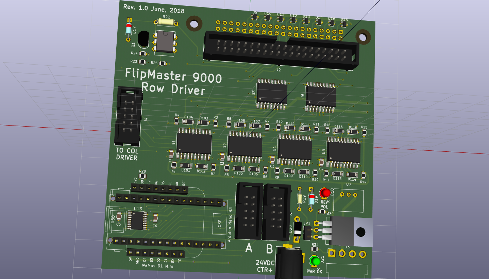
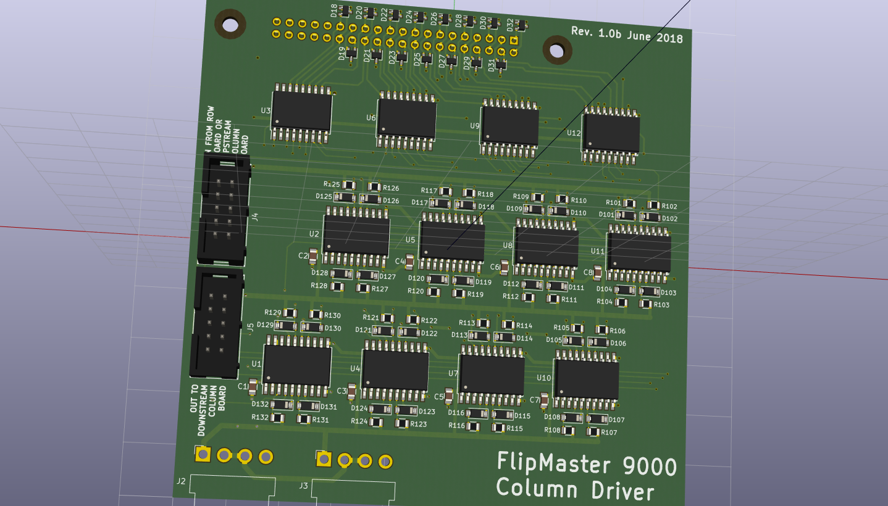

# Annax Flipdot Driver #

This is a driver for Annax flipdot display panels, with an ESP8266 (Wemos D1 Mini) controller.

The controller consists of a row driver PC board, which contains the microcontroller,
and a column driver PC board. A span of panels can be any length. One row driver daisy
chains to all the panels, and each panel has its own column driver. The row and column
driver boards are connected together with a serial interface.

The row board acts as the master controller, and holds either an Arduino Nano or a WeMos D1 Mini
module.

The Nano has enough GPIO pins to supprt off-board connections to external controls,
supporting interactive applications. 

The WeMos D1 Mini is an ESP8266 device, with built-in WiFi capability. This allows using
the panel for signage, with remote configuration capability.

